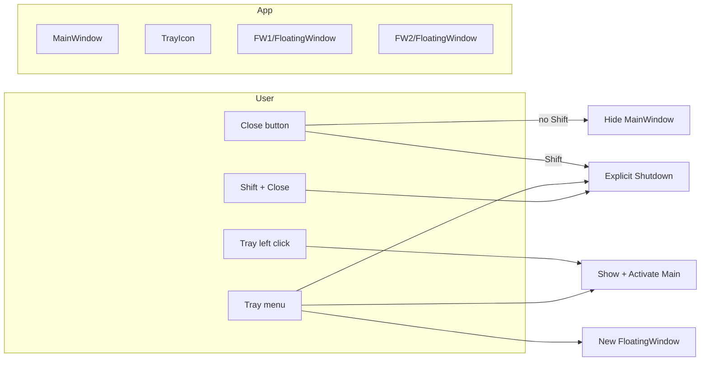

# 后台驻留与系统托盘 技术规格文档

## 1. 概述

主窗口在用户使用标题栏关闭按钮（无修饰键）或系统等效「关闭」请求时，不结束进程，而是隐藏并驻留在系统托盘，以便运行中任务与后台逻辑持续工作。用户通过托盘左键单击恢复主窗口，通过托盘右键菜单打开主窗口或新开悬浮窗；退出应用需通过托盘「Exit」或使用 **Shift + 关闭**。

**范围内：**

- 桌面生命周期 `ShutdownMode` 与显式退出路径
- `TrayIcon`（图标、左键、右键 `NativeMenu`）
- `MainWindow` 关闭/隐藏与 `Closing` 行为
- 与现有 `FloatingWindow` 多实例策略一致（每次菜单项新开，共享数据层）
- 标题栏「最小化」仍为系统默认最小化到任务栏（不变）

**范围外：**

- 设置页中「关闭时是否进托盘」等可配置开关（可作为后续迭代）
- macOS 菜单栏与 Windows 托盘行为差异的细粒度对齐（以实现期 Avalonia 平台行为为准）

---

## 2. 需求分析

### 2.1 功能需求

- [x] **FR-1**：无 Shift 时，主窗口关闭请求（自定义关闭按钮、`Alt+F4` 等触发 `Closing` 的路径）应 **取消真正关闭**，改为 `Hide()`，进程继续运行。
- [x] **FR-2**：**Shift + 标题栏关闭按钮** 时，应 **真正退出应用**（与其它显式退出路径一致）。
- [x] **FR-3**：应用启动时在 **Windows 托盘区** 显示 `TrayIcon`；**左键单击** 仅 **显示并激活主窗口**（`Show()` + `Activate()` + 必要时 `WindowState.Normal`）。
- [x] **FR-4**：托盘 **右键菜单** 至少包含：**Show Main Window**、**New Floating Window**、**Exit**。`Exit` 与 Shift+关闭 均调用同一套退出逻辑。
- [x] **FR-5**：**New Floating Window** 与主窗口工具栏打开悬浮窗行为一致：`GetRequiredService<FloatingViewModel>()` + `new FloatingWindow(vm).Show()`，允许 **多个悬浮窗**；数据通过已有单例 `RunningTaskManager`、`ITodoService`、`TaskEventBus` 共享。
- [x] **FR-6**：标题栏 **最小化** 按钮仍为 `WindowState = Minimized`（任务栏可见），**不**改为仅托盘隐藏。
- [x] **FR-7**（数据/界面同步）：多悬浮窗与主窗口共享 `RunningTaskManager.Instances` 等已有集合；悬浮窗内「可选列表」dropdown 在窗口 **Activated** 时调用 `LoadAvailableListsAsync()`，以便主窗口增删列表后切换回悬浮窗能看到更新（实现轻量、与现有 `FloatingWindow` 加载逻辑一致）。

### 2.2 非功能需求

- **稳定性**：退出前 **移除或释放** `TrayIcon`，避免 Avalonia/Windows 上已知的托盘残留或关闭顺序问题（见第 6 节）。
- **UX**：托盘菜单文案使用英文（与现有 UI 术语一致）；图标可使用内嵌小图或占位资源。

### 2.3 前置条件与依赖

- **Avalonia** 11.x（`OnFlight.App.csproj`）
- 现有类型：`App`、`MainWindow`、`FloatingWindow`、`FloatingViewModel`（Transient）、`RunningTaskManager`（Singleton）、`TaskEventBus`（Singleton）
- `IClassicDesktopStyleApplicationLifetime`：`ShutdownMode`、`Shutdown()`。

---

## 3. 系统设计

### 3.1 架构概览

在 `App` 初始化桌面生命周期时设置 `ShutdownMode = OnExplicitShutdown`，使「最后一个窗口关闭」不会自动结束进程。主窗口隐藏后应用仍存活，由 `TrayIcon` 驱动再次显示或退出。悬浮窗继续以多实例 + 共享服务的方式运作。



### 3.2 数据模型

无新增持久化模型。可选：在 `App` 内用私有字段持有 `TrayIcon` 引用以便释放。

### 3.3 接口设计

建议在 `App` 中集中维护托盘与退出，避免散落魔法字符串：

```csharp
// App.axaml.cs — conceptual API (English identifiers)
private TrayIcon? _trayIcon;

private void EnsureTrayIcon(IClassicDesktopStyleApplicationLifetime desktop);
private void ShowMainWindow();
private void OpenNewFloatingWindow();
private void QuitApplication(); // dispose tray, flush logs, desktop.Shutdown()
```

`MainWindow` 构造函数或 `Loaded` 中保存 `MainWindow` 引用到 `App` 或静态可访问处，供托盘 `ShowMainWindow` 使用（或使用 `desktop.MainWindow` 在隐藏后仍指向同一实例）。

主窗口关闭按钮处理示例逻辑：

```csharp
private void OnCloseClick(object? sender, RoutedEventArgs e)
{
    var modifiers = KeyboardDevice.Instance?.Modifiers ?? KeyModifiers.None;
    if ((modifiers & KeyModifiers.Shift) != 0)
        ((App)Application.Current!).QuitApplication();
    else
        Hide(); // do not call Close() for "to tray" path
}
```

`Closing` 处理器：若 **不是** 应用级退出，则 `e.Cancel = true` 并 `Hide()`，以覆盖 `Alt+F4` 等未走自定义按钮的路径。**注意**：Shift+关闭 应走 `QuitApplication()`，并在退出前设置标志令 `Closing` 不再 cancel（或先 `Dispose` 托盘再 `Shutdown`，按实现期线程安全选择一种顺序）。

### 3.4 流程设计

1. **启动**：`BuildServiceProvider` → `MainWindow` → 创建并显示 `TrayIcon`，订阅 `Clicked`（左键）与 `NativeMenu` 命令。
2. **关主窗口到托盘**：`Hide` 主窗口；悬浮窗若仍打开可保留（不要求随主窗口一并隐藏）。
3. **Show Main**：`MainWindow.Show()`，`Activate()`，若最小化则恢复 `WindowState`。
4. **New Floating**：与 `MainWindow.OnOpenFloatingWindow` 相同逻辑（可提取为 `App.OpenNewFloatingWindow()` 供两处调用）。
5. **退出**：清理 `TrayIcon` → `Log.CloseAndFlush()`（若仍挂在 `ShutdownRequested`）→ `desktop.Shutdown()`。

### 3.5 UI/交互设计

| 交互 | 行为 |
|------|------|
| 关闭（无 Shift） | 主窗口隐藏，托盘仍在 |
| Shift + 关闭 | 退出应用 |
| 最小化 | 与现网一致，任务栏 |
| 托盘左键 | 仅主窗口前置 |
| 托盘右键 | Show Main / New Floating / Exit |

---

## 4. 实现计划

### 4.1 文件变更清单

| 操作 | 文件路径 | 说明 |
|------|----------|------|
| 修改 | `src/OnFlight.App/App.axaml` | 可选：声明 `TrayIcon`（或在 `App.axaml.cs` 纯代码创建，二选一） |
| 修改 | `src/OnFlight.App/App.axaml.cs` | 设置 `ShutdownMode`；创建/释放 `TrayIcon`；`ShowMainWindow`、`OpenNewFloatingWindow`、`QuitApplication`；在 `desktop` 上挂接退出清理 |
| 修改 | `src/OnFlight.App/Views/MainWindow.axaml.cs` | `OnCloseClick`：Shift → `Quit`；否则 `Hide()`；`Closing`：`cancel` + `Hide` 除非显式退出；可将打开悬浮窗重构为调用 `App` 方法 |
| 修改 | `src/OnFlight.App/Views/FloatingWindow.axaml.cs` | `Activated`（或已有 `Loaded` 之后）调用 `_viewModel?.LoadAvailableListsAsync()` 以满足 FR-7 |
| 可选新增 | `src/OnFlight.App/Assets/tray.png` | 小尺寸托盘图标，`<AvaloniaResource Include="..\Assets\**\*.*"/>` 按需加入 csproj |
| 修改 | `src/OnFlight.App/OnFlight.App.csproj` | 若新增资源则加入 `AvaloniaResource` |

### 4.2 实现步骤

1. 在 `OnFrameworkInitializationCompleted` 中取得 `IClassicDesktopStyleApplicationLifetime`，设置 `ShutdownMode = ShutdownMode.OnExplicitShutdown`。
2. 实现 `EnsureTrayIcon`：`Icon` 绑定资源或占位；`ToolTip` 为应用名；`Clicked` → `ShowMainWindow`；`Menu` → `NativeMenuItem` 三条。
3. 实现 `QuitApplication`：`try { _trayIcon?.Dispose(); _trayIcon = null; }`，再 `Shutdown`；与现有 `ShutdownRequested` 中 `Log.CloseAndFlush()` 协调，避免重复或漏刷日志。
4. `MainWindow`：`OnCloseClick` 分支；订阅 `Closing` 统一「进托盘」；显式退出标志在 `QuitApplication` 置位后在 `Closing` 中 `e.Cancel = false` 或跳过 cancel 逻辑。
5. `FloatingWindow`：增加 `Activated` 处理器调用 `LoadAvailableListsAsync`（注意异常记录，避免未观测任务异常）。
6. 手动验证：无 Shift 关闭 → 托盘仍在；左键 → 主窗口出现；右键多开悬浮窗 → 各窗实例列表与运行卡片一致；Shift+关闭与 Exit → 进程结束且无托盘残留。

### 4.3 数据库迁移

无。

---

## 5. 测试策略

- **手动**：Windows 10/11 托盘左键/右键、多悬浮窗并发、主窗口最小化与从托盘恢复、Shift+关闭、托盘 Exit。
- **回归**：主窗口内原有「悬浮窗 FAB」仍正常；运行中任务在主窗口隐藏期间仍可推进（依赖现有 `RunningTaskManager`）。
- **边界**：无托盘环境或远端桌面（降级行为以实现期为准，可记在开放问题）。

---

## 6. 风险与备选方案

| 风险 | 影响 | 概率 | 备选方案 |
|------|------|------|----------|
| Avalonia `TrayIcon` 与 `Shutdown` 顺序导致残留或异常 | 中 | 低-中 | 退出前 `Dispose` 托盘；查阅当前 11.x Issue，必要时延迟 `Shutdown` 一帧 |
| `Alt+F4` 与 `Closing` 中 `Hide` 与 Shift 路径竞态 | 低 | 低 | 用显式 `_isQuitting` 标志统一分支 |
| 多 `FloatingViewModel` 仅共享 `AvailableLists` 刷新策略不足 | 低 | 中 | 已采用 `Activated` 刷新；后续可增 `TaskEventBus` 列表变更事件 |

---

## 7. 开放问题

- 是否在首启时提示「应用仍在托盘运行」（首次体验，可选，本次规格不强制）。

---

## 8. 已确认决策（来自需求澄清）

1. 托盘 **单击** 仅恢复 **主窗口**。
2. 悬浮窗 **允许多实例**；右键 **New Floating Window** 与工具栏逻辑一致；数据/界面通过共享服务 + 悬浮窗 **Activated** 刷新列表满足同步预期。
3. **退出**：托盘 **Exit** + **Shift + 关闭** 均需实现。
4. **最小化** 维持现状（任务栏）。

---

## 下游步骤

- 可使用 **spec-reviewer** 评审：`docs/features/background-resident-tray/spec.md`
- 评审通过后，可使用 **pm-task-pipeline** 基于该 spec 开发
