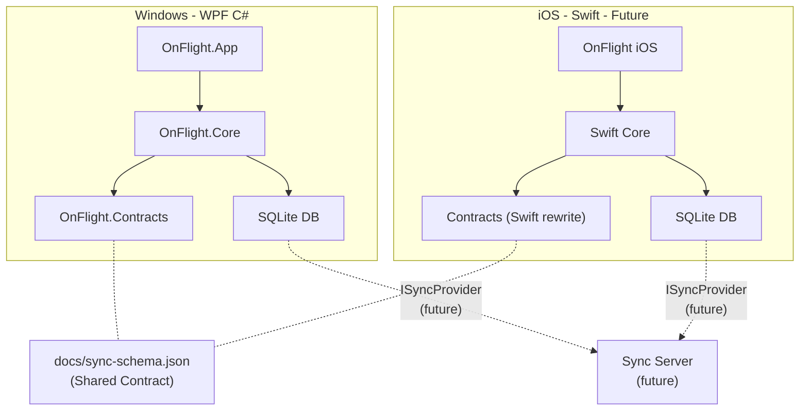

# OnFlight - 可重入 Todo List App

## 设计原则

- **契约先行**: 独立的 `OnFlight.Contracts` 层定义跨平台数据模型和接口，C# 和 Swift 端各自实现
- **同步就绪**: 所有实体携带同步元数据（UpdatedAt, DeviceId, IsDeleted 软删除），SQLite schema 保持跨平台一致
- **接口隔离**: 同步机制通过 `ISyncProvider` 接口预留，当前使用空实现（`NoOpSyncProvider`），未来可插入 CloudKit / 自建服务端等

## 技术栈

- **框架**: WPF on .NET 8 (LTS)
- **架构**: MVVM (CommunityToolkit.Mvvm)
- **UI 库**: Material Design in XAML Toolkit (现代美观 + 丰富动画)
- **数据库**: SQLite (via Microsoft.Data.Sqlite + Dapper)
- **DI**: Microsoft.Extensions.DependencyInjection
- **序列化**: System.Text.Json (快照序列化，跨平台 JSON 契约)

## 项目结构

```
OnFlight/
├── OnFlight.sln
├── docs/
│   └── sync-schema.json            # 跨平台 JSON Schema 规范（Swift 端参照此文件）
├── src/
│   ├── OnFlight.Contracts/          # 跨平台数据契约（纯 C# 类库，无平台依赖）
│   │   ├── Models/                  # 平台无关的数据模型 (POCO)
│   │   │   ├── TodoItemDto.cs       # DTO: 供序列化/反序列化/同步传输
│   │   │   ├── TodoListDto.cs
│   │   │   ├── FlowNodeDto.cs
│   │   │   ├── SnapshotDto.cs
│   │   │   └── OperationLogDto.cs
│   │   ├── Enums/
│   │   │   ├── TodoStatus.cs        # Pending/Ready/Done/Skipped
│   │   │   ├── FlowNodeType.cs      # Task/Loop/Fork/Join/Branch
│   │   │   └── OperationType.cs     # Add/Delete/Update/Check/Uncheck...
│   │   ├── Sync/
│   │   │   ├── ISyncProvider.cs     # 同步接口定义（Push/Pull/Resolve）
│   │   │   ├── SyncPayload.cs       # 同步数据包：变更集 + 时间戳
│   │   │   ├── SyncResult.cs        # 同步结果
│   │   │   └── ConflictResolution.cs # 冲突解决策略枚举
│   │   └── Schema/
│   │       └── SchemaVersion.cs     # 数据库 schema 版本常量
│   ├── OnFlight.Core/              # 核心业务逻辑（依赖 Contracts，无 UI 依赖）
│   │   ├── Models/
│   │   │   ├── TodoItem.cs          # 领域模型（含 UpdatedAt, DeviceId 同步元数据）
│   │   │   ├── TodoList.cs
│   │   │   ├── FlowNode.cs
│   │   │   ├── Snapshot.cs
│   │   │   └── OperationLog.cs
│   │   ├── Services/
│   │   │   ├── ITodoService.cs / TodoService.cs
│   │   │   ├── IFlowEngine.cs / FlowEngine.cs
│   │   │   ├── ISnapshotService.cs / SnapshotService.cs
│   │   │   ├── ILogService.cs / LogService.cs
│   │   │   └── NoOpSyncProvider.cs  # ISyncProvider 空实现（占位）
│   │   ├── Mapping/
│   │   │   └── DtoMapper.cs         # 领域模型 <-> DTO 双向映射
│   │   └── Data/
│   │       ├── DatabaseInitializer.cs
│   │       ├── Repositories/
│   │       └── Migrations/
│   └── OnFlight.App/               # WPF 应用层
│       ├── App.xaml / App.xaml.cs
│       ├── ViewModels/
│       │   ├── MainViewModel.cs
│       │   ├── TodoItemViewModel.cs
│       │   ├── ItemConfigViewModel.cs  # 右侧配置面板 VM
│       │   ├── FlowOverviewViewModel.cs # 只读流程图 VM
│       │   ├── HistoryViewModel.cs
│       │   └── FloatingViewModel.cs
│       ├── Views/
│       │   ├── MainWindow.xaml       # 主窗口（左侧列表 + 右侧配置面板）
│       │   ├── FloatingWindow.xaml   # 悬浮窗（紧凑 + 展开模式）
│       │   ├── TodoListView.xaml     # 列表视图（树形缩进展示层级）
│       │   ├── ItemConfigPanel.xaml  # 右侧配置面板（类型/条件/循环参数）
│       │   ├── FlowOverviewView.xaml # 只读流程图视图
│       │   └── HistoryView.xaml
│       ├── Controls/
│       │   ├── TodoBlock.xaml        # 列表中的 Todo 构建块
│       │   ├── FlowNodeVisual.xaml   # 流程图中的只读节点可视化
│       │   └── TimelineControl.xaml
│       ├── Converters/
│       ├── Styles/
│       │   └── Theme.xaml
│       └── Assets/
```

## 跨平台同步架构




关键设计点：

- `OnFlight.Contracts` 中的 DTO 和枚举定义了跨平台数据契约，Swift 端按照 `docs/sync-schema.json` 规范实现对应的 Swift struct
- SQLite schema 两端完全一致（同一份建表 SQL，通过 `SchemaVersion` 管控迁移）
- 所有实体使用 UUID (Guid) 作为主键，天然适合分布式/多设备场景
- 每条记录携带 `UpdatedAt` (UTC ISO8601) 和 `DeviceId` 字段，为未来 last-write-wins 或 CRDT 同步策略提供基础
- 软删除（`IsDeleted` 标志）代替物理删除，确保同步时不丢失删除操作

## 核心数据模型

```mermaid
erDiagram
    TodoList ||--o{ TodoItem : contains
    TodoItem ||--o| TodoList : "has sub-list"
    TodoItem ||--o| FlowNode : "is flow node"
    FlowNode ||--o{ FlowNode : children
    TodoList ||--o{ Snapshot : snapshots
    TodoList ||--o{ OperationLog : logs

    TodoItem {
        guid Id PK
        string Title
        string Description
        int Status
        int SortOrder
        guid ParentListId FK
        guid SubListId FK_nullable
        int NodeType
        string FlowConfigJson nullable
        datetime CreatedAt
        datetime UpdatedAt
        string DeviceId
        bool IsDeleted
    }

    FlowNode {
        guid Id PK
        int NodeType
        guid ParentId FK_nullable
        string Condition nullable
        int LoopCount nullable
        guid TodoItemId FK
        datetime UpdatedAt
        string DeviceId
        bool IsDeleted
    }

    TodoList {
        guid Id PK
        string Name
        guid ParentItemId FK_nullable
        datetime CreatedAt
        datetime UpdatedAt
        string DeviceId
        bool IsDeleted
    }

    Snapshot {
        guid Id PK
        guid ListId FK
        string StateJson
        string Description
        datetime CreatedAt
        string DeviceId
    }

    OperationLog {
        guid Id PK
        guid ListId FK
        int OperationType
        string Detail
        guid SnapshotId FK_nullable
        datetime Timestamp
        string DeviceId
    }
```


注意：枚举类型在 SQLite 中以 `int` 存储，JSON 序列化时使用 `string`（如 `"Pending"`），确保跨语言可读性。

## ISyncProvider 接口设计（预留）

```csharp
public interface ISyncProvider
{
    Task<SyncResult> PushChangesAsync(SyncPayload payload, CancellationToken ct = default);
    Task<SyncPayload> PullChangesAsync(DateTime since, CancellationToken ct = default);
    Task<ConflictResolution> ResolveConflictAsync(SyncConflict conflict, CancellationToken ct = default);
}
```

当前使用 `NoOpSyncProvider`（所有方法返回空/成功），未来可替换为：

- CloudKit 同步（iOS 原生）
- 自建 REST/gRPC 服务端
- P2P 直连同步

## 功能模块设计

### 1. Todo 基础功能 (CRUD) + 列表式操作

- TodoItem 作为核心构建块，支持标题、描述、状态、排序
- **主窗口布局: 左侧列表 + 右侧配置面板**
  - 左侧：树形列表，通过缩进展示 Todo 层级关系，支持折叠/展开
  - 右侧：选中某个 Item 后，展示其详细配置面板（类型、条件、循环参数等）
- 列表中点击 "+" 按钮新增 Todo Item，默认为 Task 类型
- 拖拽排序，滑动/右键删除
- 支持在任意 TodoItem 下创建 SubList（子列表），通过缩进展示嵌套
- 面包屑导航展示当前层级路径

### 2. 流水线式可编程构建块（列表内配置）

- 在右侧配置面板中，可将 TodoItem 的类型切换为：
  - **Task**: 普通任务节点（默认）
  - **Loop**: 循环块，其子项会被重复执行，面板中配置循环次数或终止条件
  - **Fork**: 分支块，其子项为并行分支（可带 if 条件判断），面板中配置分支条件
  - **Join**: 汇合块，面板中配置等待策略（等待所有 / 任一完成）
  - **Branch**: Fork 内的条件分支，面板中填写条件表达式
- 切换类型后，列表中该 Item 的图标和样式会对应变化（如 Loop 显示循环图标，Fork 显示分叉图标）
- **只读流程图视图 (FlowOverviewView)**: 自动根据列表的层级结构和节点类型，生成流程可视化图，用于全局查看流程走向，不可在图上编辑
- FlowEngine 负责按拓扑顺序执行/推进流程，处理循环计数、条件求值
- 条件表达式支持简单的变量引用和比较（如 `count > 3`，`status == "done"`）

### 3. 悬浮窗

- FloatingWindow 两种模式：
  - **紧凑模式**: 小型置顶悬浮球/条，显示当前任务进度，点击可快速勾选
  - **展开模式**: 点击展开为固定悬浮面板，显示完整当前列表，支持基本操作
- 支持拖拽移动，窗口置顶 (Topmost)
- 透明背景 + 圆角 + 阴影，使用 WindowStyle=None + AllowsTransparency
- 双击悬浮球回到主窗口

### 4. 历史快照与日志

- 每次操作（增/删/改/勾选等）自动记录 OperationLog
- 用户可手动或自动触发快照（序列化整个 TodoList 树为 JSON 存入 SQLite）
- HistoryView 提供时间线视图，可浏览/对比/恢复任意快照
- 日志支持筛选和搜索

## 关键 NuGet 依赖

- `CommunityToolkit.Mvvm` (MVVM 基础设施)
- `MaterialDesignThemes` + `MaterialDesignColors` (UI 主题)
- `Microsoft.Data.Sqlite` (SQLite 连接)
- `Dapper` (轻量 ORM)
- `Microsoft.Extensions.DependencyInjection` (DI 容器)
- `Microsoft.Extensions.Logging` + `Serilog.Sinks.SQLite` (结构化日志)

## 实施顺序

分阶段实现，先打通核心链路再逐步增强。先完成 Contracts + Core 层确保数据契约稳固，再构建 UI。